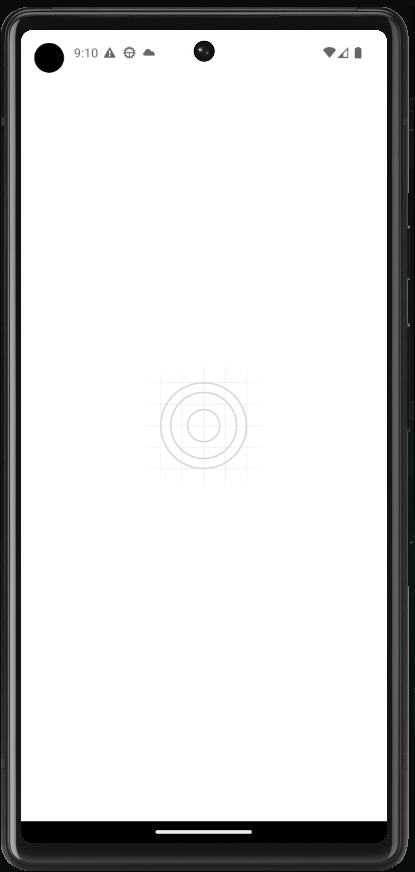

# IgniteTeam

The proposal to help organize people who get together to play in groups. It is an application with navigation in stacks where it is possible to register/remove classes/team members and store this information in the local storage of the device, preserving the data even if the app is closed.

<p align="center">
  
</p>

## Tech Stack

- [React Native](https://reactnative.dev/)
- [TypeScript](https://www.typescriptlang.org)
- [Expo](https://expo.io/)
- [Styled Components](https://styled-components.com/)
- [React Native Async Storage](https://github.com/react-native-async-storage/async-storage)

## Installation

```
npm i
```

```
npx expo start
```
